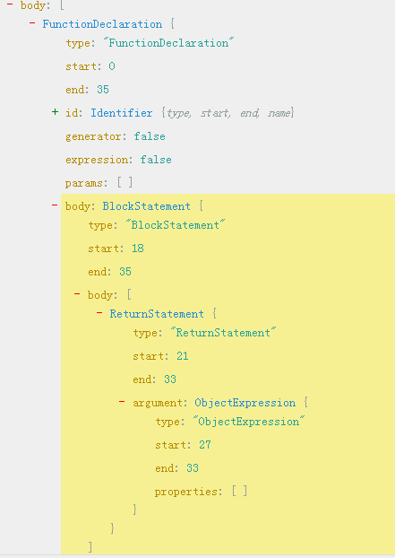
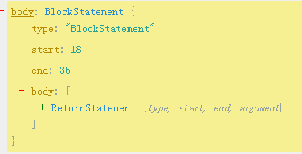
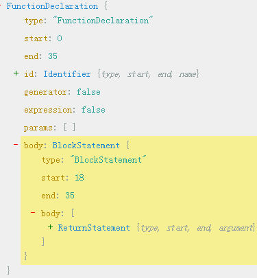

#### 1.babel-plugin-add-module-export的plugin
下面展示的是如何写一个babel插件
```js
module.exports = ({types}) => ({
  visitor: {
    Program: {
     //exit表示进入节点
      exit (path) {
        if (path.BABEL_PLUGIN_ADD_MODULE_EXPORTS) {
         //是否已经处理过了一次,这里的path是整个AST的最高层program
         //因为我们这里是对visitor中的program进行处理的
          return
        }
        let hasExportDefault = false
        let hasExportNamed = false
        //得到语法树所有的`body`部分，如果需要访问该Node请使用path.node!
        path.get('body').forEach((path) => {
          if (path.isExportDefaultDeclaration()) {
            //是否是通过export default来向外导出的，如果是那么我们继续循环下面的导出语句,这里的forEach语句会继续执行下面的循环
            hasExportDefault = true
            return
          }
          //export Test这种方式
          if (path.isExportNamedDeclaration()) {
            if (path.node.specifiers.length === 1 && path.node.specifiers[0].exported.name === 'default') {
              hasExportDefault = true
              //已经导出了default
            } else {
              hasExportNamed = true
              //表示导出了
            }
            return
          }
        })
        //如果有了export default类型导出，同时没有export { foo, awesome, bar };  这种导出，那么我们就会处理export default为module.exports =exports.default
        if (hasExportDefault && !hasExportNamed) {
          path.pushContainer('body', [
          //t.assignmentExpression(operator, left, right)
            types.expressionStatement(types.assignmentExpression(
              '=',
              types.memberExpression(types.identifier('module'), types.identifier('exports')),
              types.memberExpression(types.identifier('exports'), types.stringLiteral('default'), true)
              //t.memberExpression(object, property, computed)
              //此时module.exports = exports.default
              //最后采用pushContainer将其放在Program的body的最后面
            ))
          ])
        }
        path.BABEL_PLUGIN_ADD_MODULE_EXPORTS = true
      }
    }
  }
})
```
下面是细节部分：如果使用了ES6的export default
```js
export default class Test {}
//此时path.isExportDefaultDeclaration()为true
```
如果使用了ES6的export那么：
```js
export class Test {}
//此时path.isExportNamedDeclaration()为true，但是此时我们的node的specifier是[]，即空数组
```
如果使用了module.exports(commonjs),那么我们的该插件不会做任何处理！！！
```js
export { foo, awesome, bar };  
//此时specifier如下
```


```js
export{ foo as default };  
//此时将会满足path.node.specifiers.length === 1 && path.node.specifiers[0].exported.name === 'default'
```
至于上面的exit时机，可以[查看这里](http://www.tuicool.com/articles/IZzEJjm)，其中enter表示进入节点而leave表示离开节点！

总之：该插件只会处理`export default/export{ foo as default }`这种类型，将它处理为`module.exports=exports.default`，而像如`export { foo, awesome, bar };`  这种类型是不会处理的,他会`原样保存到源码中`!

#### 2.下面是babel-plugin-import的plugin源码
```js
import assert from 'assert';
import Plugin from './Plugin';
const util = require('util');
//默认这里传入的参数是babel，可以通过babel.types获取types，这里使用了解构的方式
//在babelrc中配置内容如下:
// ["aa", { "libraryName": "antd" }]
export default function ({ types }) {
  let plugins = null;
  // Only for test
  global.__clearBabelAntdPlugin = () => {
    plugins = null;
  };

//t.program(body, directives)
//这里的body是将源代码转化为AST的结果，program是语法树的最高层
//opts表示获取到的对象，即{ libraryName: 'antd' }
  function Program(path, { opts }) {
     // console.log(util.inspect(opts,{showHidden:true,depth:4}));
     // console.log("--------------------------");
    // Init plugin instances once.
    if (!plugins) {
      if (Array.isArray(opts)) {
        plugins = opts.map(({ libraryName, libraryDirectory, style, camel2DashComponentName, camel2UnderlineComponentName }) => {
          assert(libraryName, 'libraryName should be provided');
          return new Plugin(libraryName, libraryDirectory, style, camel2DashComponentName, camel2UnderlineComponentName, types);
        });
      } else {
        opts = opts || {};
        assert(opts.libraryName, 'libraryName should be provided');
        //必须提供libraryName
        plugins = [
          new Plugin(opts.libraryName, opts.libraryDirectory, opts.style, opts.camel2DashComponentName, opts.camel2UnderlineComponentName, types),
        ];
      }
    }
    // console.log('>>>>arguments>>>',arguments);
    // 这里的arguments一个是第一个path，第二个是PluginPass对象
    applyInstance('Program', arguments, this);
  }

  const methods = [
    'ImportDeclaration',
    'CallExpression',
    'MemberExpression',
    'Property',
    'VariableDeclarator',
    'LogicalExpression',
    'ConditionalExpression',
    'IfStatement',
    'ExpressionStatement',
    'ExportDefaultDeclaration',
  ];
  //此处的method就是如"ImportDeclaration"等
  //如果该plugin能够处理import，那么我们就使用这个babel的这个plugin来处理
  function applyInstance(method, args, context) {
    for (const plugin of plugins) {
      if (plugin[method]) {
        plugin[method].apply(plugin, [...args, context]);
      }
    }
  }
 //默认visitor中有一个Program:function Program(){} 
 //detail:https://github.com/liangklfang/babel/tree/master/packages/babel-types
//t.program(body, directives)
  const ret = {
    visitor: { Program },
  };

  for (const method of methods) {
    //为我们的Visitor添加babel处理规则，其中visitor中每一个属性的值都是一个函数
    ret.visitor[method] = function () {
      //t.importDeclaration(specifiers, source)
      //这里的arguments在调用的时候会自动执行，ret.visitor是为了维持上下文而已
      applyInstance(method, arguments, ret.visitor);
    };
  }
  return ret;
}
```
我们先不分析Plugin这个插件到底做了什么，我们先分析下上面这段代码到底做了什么？以及我们到底能学到什么？

（1）首先看看下面这段代码：
```js
export default function ({ types }) {}
//这里传入的其实是babel对象，其含有的内容很丰富，但是我们这里只是关注types而已，具体你可以查看下面的参考资料
```
（2）然后看看下面这段代码：
```js
  const ret = {
    visitor: { Program },
  };
```
我们的Program其实是AST最高层的节点，其中我们对babel的plugin传入的参数可以在方法Program中获取到!如下：
```js
  function Program(path, { opts }) {}
  //通过opts获取配置的参数
```
其中完整的Program方法传入的第二个参数的内容[可以点击这里，他是一个PluginPass对象](./sources/param.md)，你可以在上面说的babel-plugin-add-module-export这个插件中手动输出该参数，然后看一下！
（3）看看下面代码
```js
for (const method of methods) {
    //为我们的Visitor添加babel处理规则，其中visitor中每一个属性的值都是一个函数
    ret.visitor[method] = function () {
      //t.importDeclaration(specifiers, source)
      //这里的arguments在调用的时候会自动执行，ret.visitor是为了维持上下文而已
      applyInstance(method, arguments, ret.visitor);
    };
  }
```
也就是说当AST解析的时候会自动调用我们插件Plugin中的相应的方法。而且有一点一定要注意：我们的每一个方法传入的arguments对象包含两个属性，`其中第一个就是我们的path对象`，而第二个对象就是我们上面说的[PluginPass对象](./sources/param.md)]，这个对象的opts就是我们配置该babel插件时候传入的参数。完整的arguments对象可以[点击这里](./sources/node.md)。总之，`不仅仅是上面的Program，包括其他的如ImportDeclaration传入的都是一样的参数，第一个参数是path，而第二个参数是PluginPass对象`！

下面我们看看Plugin具体做了什么？我们给出主要部分：
```js
export default class Plugin {
  //实例化过程：new Plugin(libraryName, libraryDirectory, style, camel2DashComponentName, camel2UnderlineComponentName, types);
  //其中types就是传入到babel插件的types,detail:http://www.tuicool.com/articles/rMFRF32
  constructor(libraryName, libraryDirectory, style, camel2DashComponentName, camel2UnderlineComponentName, types) {
    this.specified = null;
    this.libraryObjs = null;
    this.selectedMethods = null;
    this.libraryName = libraryName;
    //libraryName配置，如配置的'antd'等
    this.libraryDirectory = typeof libraryDirectory === 'undefined'
      ? 'lib'
      : libraryDirectory;
      //libraryDirectory默认是lib目录下
    this.camel2DashComponentName = typeof camel2DashComponentName === 'undefined'
      ? true
      : camel2DashComponentName;
      //如果camel2DashComponentName没有配置那么我们转化为中间线链接的名字
    this.camel2UnderlineComponentName = camel2UnderlineComponentName;
    //camel2UnderlineComponentName转化为下划线
    this.style = style || false;
    //配置的时候添加的style，例如"css"
    this.types = types;
    //babel插件原生的types，来自于babel-types库
  }

// this.importMethod(this.specified[name], file, opts)
// 作用是：导入组件的某个方法，同时如果配置了css那么导入css
  importMethod(methodName, file, opts) {
    if (!this.selectedMethods[methodName]) {
      const libraryDirectory = this.libraryDirectory;
      //导入目录
      const style = this.style;
      //配置的style
      const transformedMethodName = this.camel2UnderlineComponentName
        ? camel2Underline(methodName)
        : this.camel2DashComponentName
          ? camel2Dash(methodName)
          : methodName;
      //对方法名称进行处理
      const path = winPath(join(this.libraryName, libraryDirectory, transformedMethodName));
      //将特定插件，特定目录，特定的方法进行处理
      this.selectedMethods[methodName] = file.addImport(path, 'default');
      //引入这个特定方法的default对象,这里是导出了这个组件本身 module.exports.default= require('path');
      //addImport返回import导入时候一个独立的id值
      if (style === true) {
        file.addImport(`${path}/style`, 'style');
        //将目录`${path}/style`下的index.js导入到style对象上，相当于module.exports.style =require(`${path}/style`)
      } else if(style === 'css') {
        file.addImport(`${path}/style/css`, 'style');
        //将文件`${path}/style/css.js`导入到style对象上
      }
    }
    //导入组件的default方法
    return this.selectedMethods[methodName];
   }
  }
```
具体代码我们已经注释过了，如果需要进一步学习，请查看[babel-traverse](https://github.com/liangklfang/babel/tree/master/packages/babel-traverse/src)
其中addImport方法的源码也贴出来：
```js
 function addImport(source, imported) {
    var name = arguments.length > 2 && arguments[2] !== undefined ? arguments[2] : imported;
    //如果只有两个参数那么name就是imported，否则就是 arguments[2] 
    var alias = source + ":" + imported;
    //source是一个路径，如file.addImport(`${path}/style/css`, 'style');
    //所以alias= `${path}/style/css` : "style"
    var id = this.dynamicImportIds[alias];
     //引入id
    if (!id) {
      source = this.resolveModuleSource(source);
      //解析路径指向的资源，即`${path}/style/css`
      id = this.dynamicImportIds[alias] = this.scope.generateUidIdentifier(name);
      //产生一个独一无二的Identifier，name就是我们第二个参数。
      //也就是通过我们的第二个参数产生一个唯一的Identifier，如上面指定的'style'
      //import style from 'antd';
      var specifiers = [];
      if (imported === "*") {
        specifiers.push(t.importNamespaceSpecifier(id));
      } else if (imported === "default") {
        specifiers.push(t.importDefaultSpecifier(id));
      } else {
        specifiers.push(t.importSpecifier(id, t.identifier(imported)));
      }
     //这里有三个Specifier，即importNamespaceSpecifier，importDefaultSpecifier，importSpecifier
      var declar = t.importDeclaration(specifiers, t.stringLiteral(source));
      //以source为名，也就是完整的路径名称来产生一个import
      declar._blockHoist = 3;
      //将这个import添加到body的最前面
      this.path.unshiftContainer("body", declar);
    }
    return id;
  }
```
#### 3.babel-plugin-check-es2015-constants
```js
export default function ({ messages }) {
  return {
    visitor: {
      Scope({ scope }) {
        //scope
        for (const name in scope.bindings) {
          const binding = scope.bindings[name];
          //binding对象
          if (binding.kind !== "const" && binding.kind !== "module") continue;
          //只关注const与module种类
          for (const violation of (binding.constantViolations: Array)) {
            throw violation.buildCodeFrameError(messages.get("readOnly", name))
            ;
          }
        }
      },
    }
  };
}
```
#### 4.操作AST实现效果
##### 4.1通过babel.transform将代码直接转化为函数字符串放到html模版中
下面我们给出要转化的代码:
```js
const code = `
import { Button, Icon } from 'antd';
const ButtonGroup = Button.Group;
ReactDOM.render(
  <div>
    <h4>Basic</h4>
    <ButtonGroup>
      <Button>Cancel</Button>
      <Button type="primary">OK</Button>
    </ButtonGroup>
    <ButtonGroup>
      <Button disabled>L</Button>
      <Button disabled>M</Button>
      <Button disabled>R</Button>
    </ButtonGroup>
    <ButtonGroup>
      <Button type="primary">L</Button>
      <Button>M</Button>
      <Button type="ghost">M</Button>
      <Button type="dashed">R</Button>
    <\/ButtonGroup>
    <h4>With Icon<\/h4>
    <ButtonGroup>
      <Button type="primary">
        <Icon type="left" \/>Go back
      <\/Button>
      <Button type="primary">
        Go forward<Icon type="right" \/>
      <\/Button>
    <\/ButtonGroup>
    <ButtonGroup>
      <Button type="primary" icon="cloud" \/>
      <Button type="primary" icon="cloud-download" \/>
    <\/ButtonGroup>
  <\/div>,
  mountNode
);`
```
我们要转化为的内容为如下形式:
```js
function preview(){
 return{
 }
}
```
我们先通过AST查看器(参考资料有链接)查看结构。如下图：



所以代码就很容易写了：
```js
'use strict';
const babel = require('babel-core');
const types = require('babel-types');
const traverse = require('babel-traverse').default;
const generator = require('babel-generator').default;
const errorBoxStyle = {
  padding: 10,
  background: 'rgb(204, 0, 0)',
  color: 'white',
  fontFamily: 'sans-serif',
  fontSize: '16px',
  fontWeight: 'bold',
  overflow: 'auto',
};
//var ReactDOM = require('react-dom')
//要转化为什么，我们可以先通过AST查看器查看然后编写~~
function requireGenerator(varName, moduleName) {
  return types.variableDeclaration('var', [
    types.variableDeclarator(
      //t.variableDeclarator(id, init)
      //id就是identifier
      //此处的init必须是一个Expression
      types.identifier(varName),
      //t.callExpression(callee, arguments)
      types.callExpression(
        types.identifier('require'),
        [types.stringLiteral(moduleName)]
      )
    ),
  ]);
}
const defaultBabelConfig = {
  presets: ['es2015-ie', 'react', 'stage-0'],
};
module.exports = function transformer(
  code,
  babelConfig = {},
  noreact
) {
  let codeAst = null;
  try {
    const { ast } = babel.transform(code, Object.assign({}, defaultBabelConfig, babelConfig));
    codeAst = ast;
   //使用babel.transform转化为AST树
  } catch(e) {
    console.error(e);
    return `function() { ` +
      `  var React = require('react');` +
      `  return React.createElement('pre', {` +
      `    style: ${JSON.stringify(errorBoxStyle)}` +
      `  }, '${e.toString()}'); ` +
      `}`;
  }
  let renderReturn = null;
  traverse(codeAst, {
    CallExpression: function(callPath) {
      const callPathNode = callPath.node;
      if (callPathNode.callee &&
          callPathNode.callee.object &&
          callPathNode.callee.object.name === 'ReactDOM' &&
          callPathNode.callee.property &&
          callPathNode.callee.property.name === 'render') {
         renderReturn = types.returnStatement(
          callPathNode.arguments[0]
         );
        //将ReactDOM.render方法的第一个参数作为return返回
        //上面已经经过babel.transform转化了~~
        callPath.remove();
      }
    },
  });
  const astProgramBody = codeAst.program.body;
  //引入对react与ReactDOM的引入
  if (!noreact) {
    astProgramBody.unshift(requireGenerator('ReactDOM', 'react-dom'));
    astProgramBody.unshift(requireGenerator('React', 'react'));
  }
  // ReactDOM.render always at the last of preview method
  if (renderReturn) {
    astProgramBody.push(renderReturn);
  }
  const codeBlock = types.BlockStatement(astProgramBody);
  //将astProgramBody转化为BlockStatement
  //t.functionDeclaration(id, params, body, generator, async)
  const previewFunction = types.functionDeclaration(
    types.Identifier('functionName'),
    [],
    codeBlock
  );
  //t.program(body, directives)
  //body: Array<Statement> (required)
  // directives: Array<Directive> (default: [])
  return generator(types.program([previewFunction]), null, code).code;
};
```
第一步：参考上图，首先构造FunctionDeclaration.body.body，其很显然是一个returnStatement
```js
 renderReturn = types.returnStatement(
          callPathNode.arguments[0]
    );
```
第二步:构建BlockStament(签名为:t.blockStatement(body, directives))
```js
  const codeBlock = types.BlockStatement(astProgramBody);
  //第一个参数就是BlockStatement的body，而body我们设置为returnStatement
```
所以此时我们构建了下面的AST结构了(也就是BlockStatement的body是一个returnStatement):



第三步：我们构建functionDeclaration(签名为:t.functionDeclaration(id, params, body, generator, async))
```js
const previewFunction = types.functionDeclaration(
    types.Identifier('preview'),
    [],
    codeBlock
    //第三个参数是body
  );
```
此时我们构建了一个functionDeclaration的body是我们上面构建的BlockStament。而且第一个参数是Identifier，所以此时我们就变成了下面的结果了:



也就是说,得到的结果为:"functionDeclaration的Identifier为preview,body是一个BlockStament，这个BlockStament的body是一个returnStatement"。这样的结果和将下面的代码转化为AST得到的结果是相同的:
```js
function preview(){
 return{
 }
}
```
到这里我们就已经把上面的那部分代码转化为函数了。下面我们再分析一下下面的这个函数:
```js
function requireGenerator(varName, moduleName) {
  return types.variableDeclaration('var', [
    types.variableDeclarator(
      //t.variableDeclarator(id, init)
      //id就是identifier
      //此处的init必须是一个Expression
      types.identifier(varName),
      //t.callExpression(callee, arguments)
      types.callExpression(
        types.identifier('require'),
        [types.stringLiteral(moduleName)]
      )
    ),
  ]);
}
```
其实这里的写法是很简单的，你只要将"var ReactDOM = require("react-dom")"放到AST查看器中就可以轻而易举的写出来~

注意：通过上面的处理，我们最后得到的`依然是string类型`，可以通过babel官方转换过程看到:
<pre>
  input string -> babylon parser -> AST -> transformer[s] -> AST -> babel-generator -> output string
</pre>
通过babel-generator我们最后得到`依然是string`。其作用也很明显[点击这里](https://github.com/liangklfangl/astexample/blob/master/test/nunjuck.js),即通过操作AST将代码转化为一个函数，并结合nunjucks将该函数放在html模板中，从而可以直接调用，实现预览效果~~~

##### 4.2结合webpack的loader操作AST得到真正的函数封装到对象上
下面是个webpack的loader内容:
```js
'use strict';
const loaderUtils = require('loader-utils');
const generator = require('babel-generator').default;
const transformer = require('./transformer');
 const fs = require('fs');
//前一个loader虽然通过module.exports={}导出，但是这里content仍然会是内容，这一点一定要注意，因为loader只会为Buffer或者string而不会是对象
module.exports = function jsonmlReactLoader(content) {
  if (this.cacheable) {
    this.cacheable();
  }
  const query = loaderUtils.getOptions(this);
  const lang = query.lang || 'react-example';
  //we get configured language in dora-plugin-preview
  const res = transformer(content, lang);
  //we input jsonml as content to tranformer function
  const inputAst = res.inputAst;
  const imports = res.imports;
  for (let k = 0; k < imports.length; k++) {
    inputAst.program.body.unshift(imports[k]);
  }
  const code = generator(inputAst, null, content).code;
  //Turns an AST into code.
  const noreact = query.noreact;
  //You can pass noreact to refuse to import react
  if (noreact) {
    return code;
  }
 const processedCode= 'const React =  require(\'react\');\n' +
        'const ReactDOM = require(\'react-dom\');\n'+
        code;
  return processedCode;
};
```
我们看看transformer做了什么处理:
```js
'use strict';
const babylon = require('babylon');
const types = require('babel-types');
const traverse = require('babel-traverse').default;
function parser(content) {
  return babylon.parse(content, {
    sourceType: 'module',
    //sourceType: Indicate the mode the code should be parsed in.
    // Can be either "script" or "module".
    plugins: [
      'jsx',
      'flow',
      'asyncFunctions',
      'classConstructorCall',
      'doExpressions',
      'trailingFunctionCommas',
      'objectRestSpread',
      'decorators',
      'classProperties',
      'exportExtensions',
      'exponentiationOperator',
      'asyncGenerators',
      'functionBind',
      'functionSent',
    ],
    //Array containing the plugins that you want to enable.
  });
}
module.exports = function transformer(content, lang) {
  let imports = [];
  const inputAst = parser(content);
  //we transform our input to AST
  traverse(inputAst, {
    //Here, our path.node is an array
    ArrayExpression: function(path) {
      const node = path.node;
      const firstItem = node.elements[0];
      //tagName
      const secondItem = node.elements[1];
      //attributes or child element
      let renderReturn;
      if (firstItem &&
        firstItem.type === 'StringLiteral' &&
        firstItem.value === 'pre' &&
        secondItem.properties[0].value.value === lang) {
        let codeNode = node.elements[2].elements[1];
        let code = codeNode.value;
        //得到代码的内容了，也就是demo的代码内容
        const codeAst = parser(code);
        //继续解析代码内容~~~
        traverse(codeAst, {
          ImportDeclaration: function(importPath) {
            imports.push(importPath.node);
            importPath.remove();
          },
          CallExpression: function(CallPath) {
            const CallPathNode = CallPath.node;
            if (CallPathNode.callee &&
              CallPathNode.callee.object &&
              CallPathNode.callee.object.name === 'ReactDOM' &&
              CallPathNode.callee.property &&
              CallPathNode.callee.property.name === 'render') {
              //we focus on ReactDOM.render method
              renderReturn = types.returnStatement(
                CallPathNode.arguments[0]
              );
              //we focus on first parameter of ReactDOM.render method
              CallPath.remove();
            }
          },
        });
        const astProgramBody = codeAst.program.body;
        //program.body are updated through previous manipulation
        const codeBlock = types.BlockStatement(astProgramBody);
        // ReactDOM.render always at the last of preview method
        if (renderReturn) {
          astProgramBody.push(renderReturn);
        }
        const coceFunction = types.functionExpression(
          types.Identifier('jsonmlReactLoader'),
          //here is an Identifier of function
          [],
          codeBlock
        );
        path.replaceWith(coceFunction);
      }
    },
    //End of Array Expression
  });
  return {
    imports: imports,
    inputAst: inputAst,
  };
};
```
通过上面的分析，这里已经很好理解了，如果你对这里的babylon有疑问，你可以[查看这里](https://github.com/liangklfangl/babylon)。正如官网所说的:
<pre>
babylon.parse(code, [options])
babylon.parseExpression(code, [options])

parse() parses the provided code as an entire ECMAScript program, while parseExpression() tries to parse a single Expression with performance in mind. When in doubt, use .parse().
</pre>
baylon将输入的代码作为ECMAScript程序来解析，所以我们的源代码通过这个loader就会变成如下形式(`会有一个函数而非函数字符串出现`),进而提供给babel-loader进一步处理~~:
```js
const React =  require('react');
const ReactDOM = require('react-dom');
import { Button } from 'antd';
module.exports = {
  "content": ["article", ["h3", "1.mark-twain解析出来的无法解析成为ast"], function jsonmlReactLoader() {
    return <div>
    <Button type="primary" shape="circle" icon="search" />
    <Button type="primary" icon="search">Search</Button>
    <Button shape="circle" icon="search" />
    <Button icon="search">Search</Button>
    <br />
    <Button type="ghost" shape="circle" icon="search" />
    <Button type="ghost" icon="search">Search</Button>
    <Button type="dashed" shape="circle" icon="search" />
    <Button type="dashed" icon="search">Search</Button>
  </div>;
  }],
  "meta": {}
};
```
今天就写到这里，以后遇到了这类问题也会及时更新中。。。。。


参考资料：

[【译】通过开发 Babel 插件理解抽象语法树（AST）](http://www.tuicool.com/articles/rMFRF32)

[Babel.js 插件开发（一）：Babel 与 AST](http://www.tuicool.com/articles/ANNFjy6)

[Babel.js插件开发之二 - 开始编写](http://www.tuicool.com/articles/7zuY3qM)

[理解 Babel 插件](http://www.tuicool.com/articles/IZzEJjm)

[AST查看器](https://astexplorer.net/#/tSIO7NIclp)

[babel-plugin-add-module-export](https://github.com/liangklfang/babel-plugin-add-module-exports/blob/master/src/index.js)

[ ES6学习——模块化：import和export](http://blog.csdn.net/kittyjie/article/details/50642558)

[babel-types](https://github.com/babel/babel/tree/7.0/packages/babel-types)